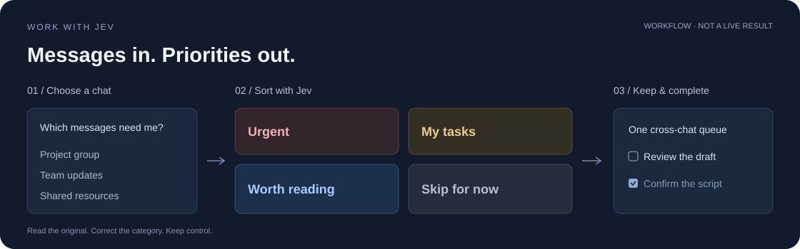

<div align="center">

<h1>Work with Jev</h1>

<p><strong>Too many work messages? Find the ones that need you.</strong></p>

<p><a href="README.md">简体中文</a> · <strong>English</strong></p>

[](https://github.com/Adkid-Zephyr/work-with-jev/actions/workflows/test.yml)
[](LICENSE)
[](https://nodejs.org/)

<p><a href="#try-it-locally">Quick start</a> · <a href="#connect-feishu">Connect Feishu</a> · <a href="docs/EXTENDING.md">Add a provider</a></p>

<a href="https://docs.typesafe.ai/introduction">
<picture>
  <source media="(prefers-color-scheme: dark)" srcset="docs/assets/typesafe-dark.png">
  
</picture>
</a>
<p><sub>Built with Jev · Independent community project</sub></p>

</div>



Choose a Feishu chat and describe your role. Jev helps sort messages into **urgent**, **my tasks**, **worth reading**, and **skip for now**. Check off what you finish. Click the chat name to search or switch chats. Add messages to a persistent cross-chat task queue and drag to reorder; switching chats preserves your previous work.

| Urgent | My tasks | Worth reading | Skip for now |
| --- | --- | --- | --- |
| The client is waiting for your confirmation | Prepare next week's topic list | An audio recording guide for your shoot | Got it 👍 |

These are illustrative examples, not live model results. The same message may matter differently to different people. The current UI is Chinese; this is an English documentation option.

## Try it locally

Requires **Node.js 22.9+** and npm. No account or key is needed for the preset demo.

```bash
git clone https://github.com/Adkid-Zephyr/work-with-jev.git
cd work-with-jev
npm ci
npm start
```

Open **http://127.0.0.1:4173**. On macOS, you can also double-click `Start.command` after installation.

Switch between the three example identities, check/uncheck messages, or click a message to inspect and correct its category. To test actual inference, enter your [TypeSafe API key](https://console.typesafe.ai/keys) in Settings and click Classify.

**The keyless demo uses labeled preset results.** It does not simulate model calls or invent latency. Timing is displayed only after actual Jev requests.

## Connect Feishu

The [official Lark/Feishu CLI](https://github.com/larksuite/cli) reads selected chats as the authorized user. No public webhook server is required.

```bash
# Skip if the CLI already has an app configured.
npx lark-cli config init --new

npx lark-cli auth login --scope "im:chat:read im:message:readonly offline_access"
```

Both application permissions and user consent must be satisfied; your organization may require administrator approval. Respond to specific missing read scopes instead of granting every permission.

The approximately 10-minute device-link lifetime is **not** the login lifetime. `offline_access` permits renewal while the refresh credential remains valid. Feishu controls expiry; this project cannot promise an arbitrary 3- or 7-day session. Inspect it with:

```bash
npx lark-cli auth status --json --verify
```

Then check the connection in Settings, choose Feishu messages, search for a chat, and describe your identity. Select **1–200 messages, default 50**. The board follows this limit. Classify automatically fetches the requested recent messages before showing the transmission preview. Click Classify and review the messages before confirming transmission to TypeSafe.

Fetching messages does not itself send them to Jev.

## Handle unclassified messages

Choose a category manually or add directly to the task queue (also assigns My tasks). These operations do not call Jev. Official message app links appear as Open in Feishu, including in task details and the queue. Refresh older cached messages to retrieve links; missing links are indicated rather than invented. The Feishu client must be signed in with access to the conversation.

## How it works

```text
Recent messages + your identity and responsibilities
                        ↓
               Jev's typed judgments
      relevant? requires action? urgent? useful?
                        ↓
               Four columns, in code
                        ↓
              Review, correct, complete
```

Probabilities are available in message details; ambiguous signals are marked for review. Completion and manual overrides stay under your control.

## Integrations

- **Implemented:** preset examples, Feishu user-authorized chat reads, Jev classification, persistent local completion and manual categories.
- **Extension point:** read-only adapters in `lib/providers/`. See [the guide](docs/EXTENDING.md) and [template](lib/providers/example.mjs).
- **Not implemented:** WeCom, DingTalk, Slack, or other work apps. A bot's message callback is not equivalent to unrestricted chat history access.

## Data and limits

<details>
<summary>Storage, permissions and model boundaries</summary>


- Binds to `127.0.0.1` only. Not a hosted multi-user service.
- Message text, categories, completion, and cross-chat task order live in browser localStorage. Clearing site data removes them. Use the same browser and URL.
- Keys entered in the UI remain in server memory and must be entered again after a restart. For persistent local configuration, copy `.env.example` to `.env` and set `TYPESAFE_API_KEY`. Never commit credentials.
- Confirmed classification sends selected messages and identity context to TypeSafe and uses your API credit. Feishu credentials are managed by its CLI.
- Text and rich-text messages only. No attachment downloads, OCR, or transcription. Bounded pagination does not guarantee full history or complete thread replies.
- Selections are split into requests of up to 20 messages and approximately 20,000 body characters. Batches do not share context. Completed batches survive a later failure.
- Probabilities are not accuracy guarantees. Initial thresholds are not calibrated on your workload. The app does not reply, delete messages, execute tasks, or automatically merge/close tasks across updates.
- No public end-to-end accuracy or speed benchmark is claimed. Offline tests do not validate live platform or model behavior.

</details>

## Open source & contributions

The application code is open source under the [MIT License](LICENSE): you may use, modify, redistribute, and use it commercially subject to the license terms. Jev remains an external TypeSafe service; its model weights and service are not included. Third-party logos retain their original ownership.

[Contributing guide](CONTRIBUTING.md) · [Report an issue](https://github.com/Adkid-Zephyr/work-with-jev/issues/new/choose) · [Use this template](https://github.com/Adkid-Zephyr/work-with-jev/generate)

## Development

```bash
npm run check
npm test
```

`dist/` contains the UI, `lib/core.mjs` the classification logic, `lib/providers/` the adapters, and `server.mjs` the local API. Tests use no credentials or paid model calls.

## Inspiration

Inspired by [browser-use/jev-ultrafast](https://github.com/browser-use/jev-ultrafast): present a concrete task and show execution and results. Our demo story is **messages in → four categories → check off completed work**. No code or performance figures were copied from that project.

Built on [TypeSafe / Jev](https://docs.typesafe.ai/introduction) and [Lark CLI](https://github.com/larksuite/cli). This is an independent project, not an official product of either service.

[MIT License](LICENSE) · [Asset attribution](docs/assets/ATTRIBUTION.md)
